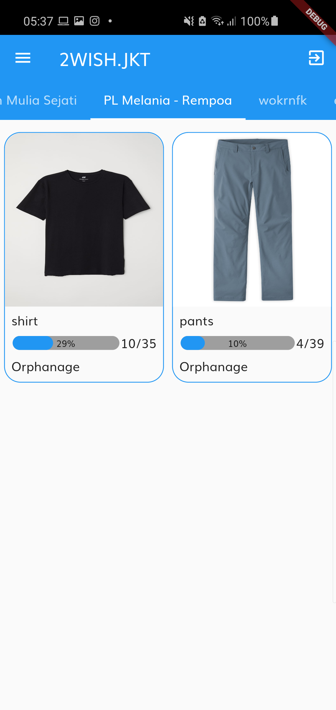
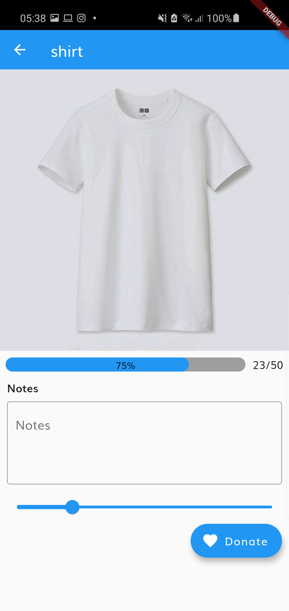

# Two Wish using Declarative UI: Flutter
Two Wish is the consumer side Flutter app of the TwoWish.jkt company that allows users to donate and contact various organisations that need donations. Users look through many organisations and determine how much they want to donate.

## 🔧 Technologies & Tools
<a href="https://firebase.google.com">

## 🖼️ Images

  
  

